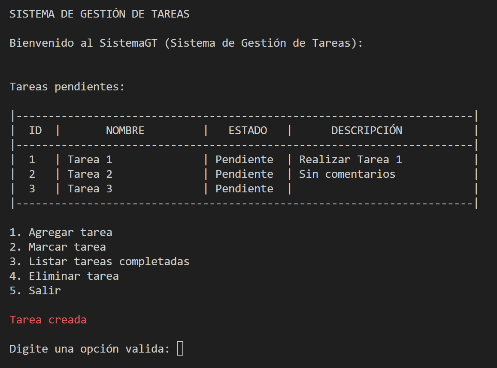

# SistemaGT
    

        El código fuente del proyecto se encuentra en el directorio “SistemaGT”.
    

    

        Este proyecto cumple la función de un Sistema de Gestión de Tareas (SistemaGT); está elaborado en C# sobre .Net
        en su versión 7.0.306, a continuación, algunas de sus características:
    

    <ul>
        <li>Aplicación de consola.</li>
        <li>Patrón de diseño MVC.</li>
        <li>Persistencia mediante el uso de un archivo de texto (.txt).</li>
    </ul>
    
La aplicación tiene las siguientes capacidades:

    <ul>
        <li>Agregar Tareas</li>
        <li>Eliminar Tareas</li>
        <li>Marcar Tareas</li>
        <li>Listar Tareas</li>
    </ul>
    
Captura de pantalla:

    
